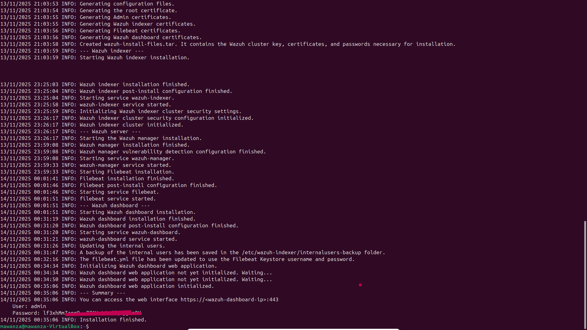
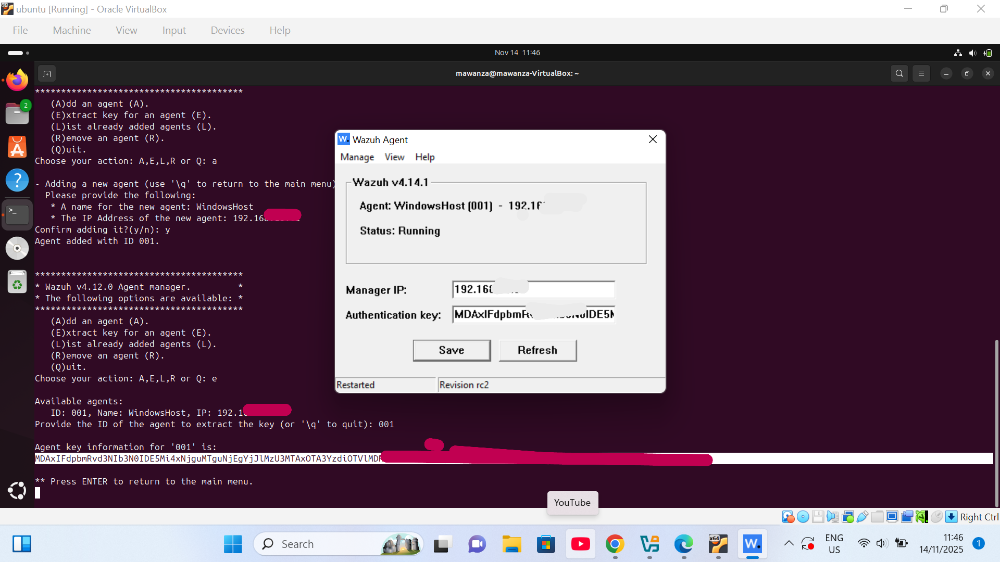
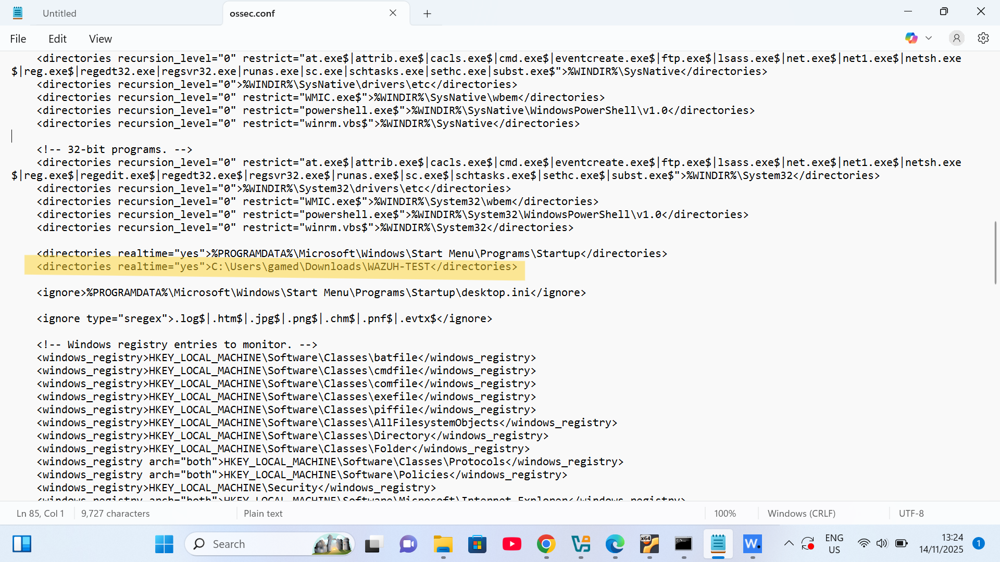
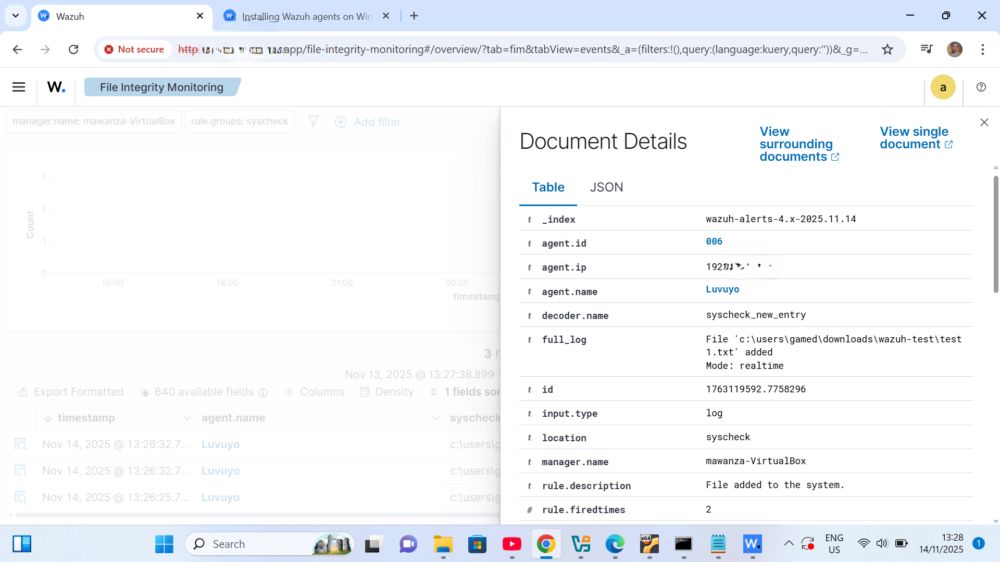
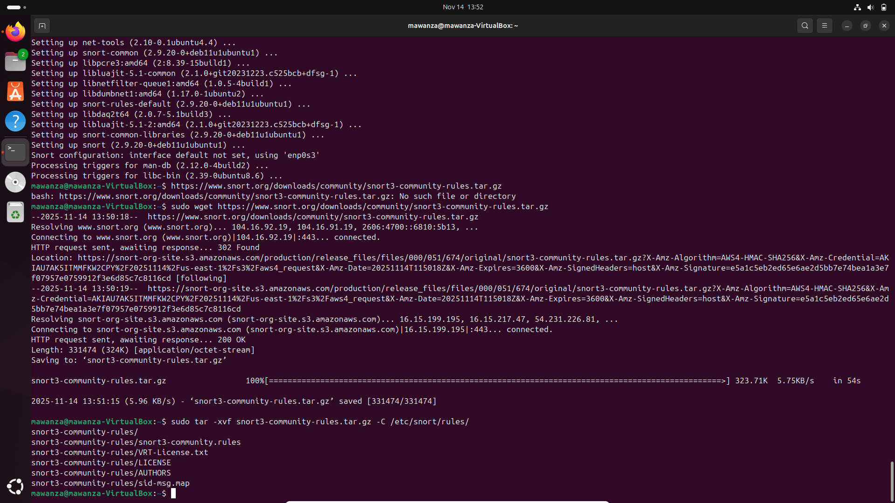
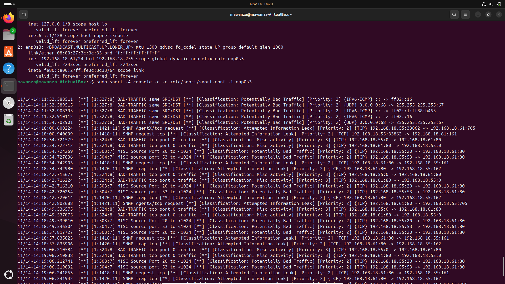
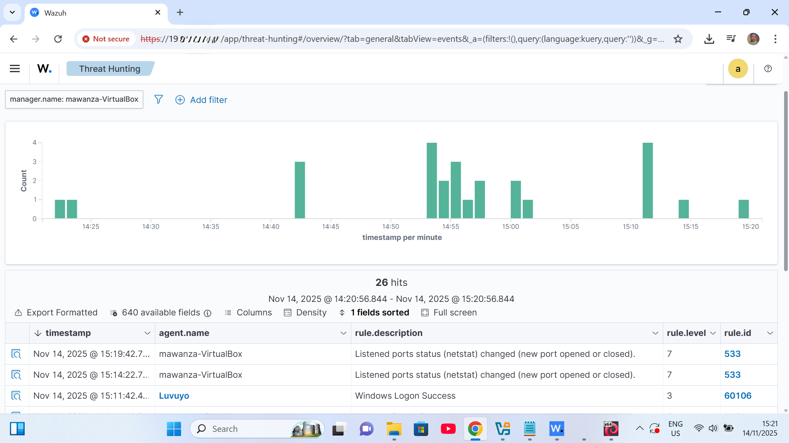
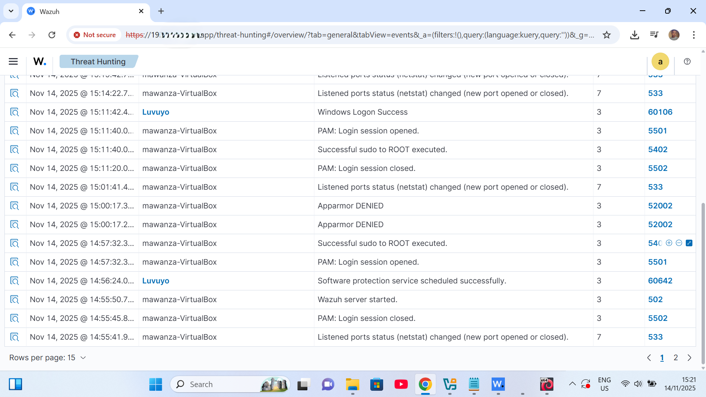

# SOC Analyst Home Lab

## Project Overview
This SOC lab simulates a real Security Operations Center using Wazuh (SIEM/XDR), Snort IDS, Windows endpoint monitoring, and Kali Linux attack traffic. The environment collects and correlates logs from endpoints, detects network intrusions, monitors file integrity, and provides visibility into system activity across the network.

I built this project to understand how modern SOC tools detect threats across endpoints and networks. By integrating Wazuh and Snort, then generating traffic from Kali, the lab demonstrates log collection, alerting, intrusion detection, and event correlation, core skills required in SOC Analyst Level 1 roles.

## Features
- **Wazuh SIEM Deployment**: Installed Wazuh Manager + Dashboard on Ubuntu Server
- **Windows Endpoint XDR**: Installed and registered Wazuh Agent on Windows
- **File Integrity Monitoring**: Real-time monitoring of Windows directory changes
- **Snort IDS Integration**: Configured Snort alerts to feed into Wazuh SIEM
- **Network Attack Simulation**: Performed ping sweeps, Nmap scans, and traffic tests from Kali Linux
- **Alert Correlation**: Combined IDS & FIM activity into a single dashboard
- **Log Analysis**: Parsed alerts for process activity, file changes, and network intrusions

## Tools & Skills Gained

### Technical Skills
- **SIEM Deployment**: Installed and configured Wazuh Manager
- **IDS Configuration**: Snort installation, rules, and syslog outpu
- **XDR Concepts**: Endpoint telemetry, agent registration, and monitoring
- **File Integrity Monitoring**: Windows directory monitoring via Wazuh Agent
- **Incident Response**: Observed alerts and analyzed potential threats
- **Log Correlation**: Aggregated logs from Windows, Ubuntu, and Snort
- **Linux Administration**: Ubuntu Server setup, systemctl, config editing
- **Kali Linux**: Nmap scanning, ping sweeps, and traffic simulation
- **Network Scanning**: Active scanning to generate test alerts
- **Virtualization**: Multi-VM lab setup in VirtualBox
- **Configuration Management**: Edited configs for Wazuh and Snort integration
- **Security Monitoring**: Continuous log and network monitoring
- **Endpoint Monitoring**: Observed Windows agent telemetry
- **Alert Analysis**: Viewed, filtered, and interpreted alerts on Waz

## Screenshots
1. **Wazuh Installation**  
     
   *Successful installation and startup of the Wazuh Mananger on Ubuntu Server*

2. **Agent Enrollment**  
     
   *Wazuh agent panel showing your Windows endpoint, IP address, and authentication key.*

3. **ossec.conf Configuration**  
     
   *Custom configuration added to ossec.conf to enable log forwarding and monitoring.*

4. **File Integrity Monitoring Test**  
     
   *Created test file on Windows that triggered a file-change alert in Wazuh*

5. **Snort Installation & Rules**  
     
   *Snort installed with community rules loaded and IDS engine running.*

6. **Snort Attack Detection (Kali Test)**  
     
   *Snort console showing triggered alerts after running Nmap/scans from Kali Linux.*

7. **Wazuh Threat Hunting View**  
   
   
   *Wazuh dashboard displaying Snort-detected attacks and Windows/Linux security events under Threat Hunting.*

## Installation
1. **Requirements**:
   - Oracle VirtualBox
   - Linux Ubuntu 20.04+ (ISO)
   - Kali Linux VM
